# Отчет о реализации и экспериментальной проверке ОПТ-1, ОПТ-2, ОПТ-3 и ОПТ-4

Дата актуализации: 20-07-2026

Репозиторий: [Vepricov/brain-opt](https://github.com/Vepricov/brain-opt/tree/codex/a2pro-opt-report)

Ветка: `codex/a2pro-opt-report`

Артефакты отчета: [`reports/a2pro-opt-2026-07`](https://github.com/Vepricov/brain-opt/tree/codex/a2pro-opt-report/reports/a2pro-opt-2026-07)

## 1. Назначение отчета

Настоящий отчет фиксирует состояние реализации, интеграции и экспериментальной проверки четырех блоков работ по программному модулю `A2.Оптимизация`:

- ОПТ-1: алгоритмы, снижающие затраты памяти при оптимизации.
- ОПТ-2: матричные и предобусловленные методы оптимизации.
- ОПТ-3: распределенные и федеративные модификации методов оптимизации.
- ОПТ-4: методы эффективного хранения больших моделей на основе post-training quantization.

Отчет подготовлен в формате, пригодном для демонстрации результатов и сверки с требованиями ТЗ. Основной акцент сделан на трех аспектах: наличие программной реализации, наличие экспериментальных артефактов и возможность вызова реализованных методов из базового образа A2.Pro.

## 2. Нормативная привязка

Проверка выполнена относительно следующих требований.

- `ТЗ 4 Платформа Сгибнев.pdf`, п. 3.2.3.7: ПМ `A2.Оптимизация` должен обеспечивать реализацию методов оптимизации, распределенных модификаций методов оптимизации и методов эффективного хранения больших моделей.
- `3 Дополнение к ТЗ Безносиков`, п. 2.5: должны быть разработаны эффективные адаптивные методы оптимизации, эффективные распределенные методы оптимизации, методы для специализированных постановок обучения и экспериментальная оценка на бенчмарках.
- `3 Дополнение к ТЗ Безносиков`, п. 3.4 и 3.5: экспериментальные образцы программного кода должны поставляться как компонент, модуль или библиотека, поддерживать конфигурации запусков, логи, метрики и итоговые таблицы результатов.
- `3 Дополнение к ТЗ Безносиков`, п. 3.5.2.1: компоненты распределенного обучения должны быть предназначены для синхронного или асинхронного обучения на одном или нескольких вычислительных кластерах с более чем одним вычислительным устройством.
- `3 Дополнение к ТЗ Безносиков`, п. 3.5.2.6: компоненты должны функционировать в составе программного модуля `A2.Оптимизация` платформы A2.Pro.
- `3 Дополнение к ТЗ Безносиков`, п. 3.7.2: испытания должны включать сравнение с базовыми решениями, метрики качества и ресурсные метрики, где они применимы.
- `ТЗ 3 Безносиков.pdf`, мероприятие 3.2 по направлению эффективного хранения больших моделей: методы квантования и прунинга на основе оптимизационных постановок.
- `ТЗ 3 Безносиков.pdf`, мероприятие 3.3 по направлению эффективного хранения больших моделей: процедуры обучения с учетом квантования.

## 3. Сводный статус

| Блок | Реализация | Экспериментальная проверка | Статус относительно ТЗ |
|---|---|---|---|
| ОПТ-1 | `brain_opt`: `AdamW`, `SGD`, `SignSGD`, `Lion`, `get_optimizer`, масштабирование learning rate | Внешний robotics-график `Lion vs AdamW`, серверный LM integration run, stage `lm_finetune` для дообучения LM из A2.Pro checkpoint, hard vision stress-test | Закрывает библиотечную реализацию оптимизаторов и демонстрационный контур. Для строгой приемки robotics-результатов нужны raw logs и описание задачи |
| ОПТ-2 | `brain_opt`: `Muon`, `Shampoo`, `SOAP`, общий API, fallback-логика для параметров | Внешний robotics-график `Muon vs AdamW`, серверный LM integration run, stage `lm_finetune` для дообучения LM из A2.Pro checkpoint, Muon-positive hard vision benchmark | Закрывает матричные и предобусловленные методы. Основной положительный результат по Muon относится к vision stress-test |
| ОПТ-3 | `brain_opt.federated`: `FedAvg`, `AsyncSGD`, `Async-LocalSGD`, учет staleness, A2.Pro stages `federated_train` и `federated_lm_finetune` | Synthetic federated demo, CIFAR-10 server run, offline smoke A2.Pro Format 2 package, federated LM fine-tune из checkpoint | Закрывает алгоритмическую и библиотечную часть. Требование о реальном multi-device или multi-cluster runtime закрыто частично |
| ОПТ-4 | `a2_kvant`, A2.Pro stage `quantize`, рецепт `W4A16/GPTQ` | Benchmark на checkpoint `Qwen2.5-Math-1.5B`, выгруженном из A2.Pro storage | Закрывает post-training quantization и ресурсный критерий `>2x` по размеру checkpoint и footprint весов. Pruning не реализован |

## 4. Интеграция через базовый образ A2.Pro

Реализация соответствует требованию о вызове методов оптимизации из базового образа, а не из локально скопированного кода решения.

Текущий A2.Pro package переведен на базовый образ `plibs:jaguar-2.6.7-a2`.
В базовый образ включены:

- `brain_opt==0.2.0`
- `a2_kvant==0.1.0`

В production path Dockerfile проверяется, что основные модули доступны как установленные библиотеки:

```python
import a2_kvant
import brain_opt
from brain_opt import get_optimizer, run_fedavg, run_async_sgd, run_async_local_sgd
```

Тем самым решение A2.Pro содержит PlatformAPI-обвязку и описание стадий, а сами оптимизационные методы поставляются как библиотечные компоненты базового образа.

Для файлов checkpoint используется обновленный PlatformAPI из `plibs:jaguar-2.6.7-a2`: большие файлы читаются и записываются через Stream API, при этом в обвязке сохранен fallback на обычные `read/write`.

Для ОПТ-1/2 и ОПТ-3 подготовлен пакет A2.Pro Format 2: [`a2pro/opt3-federated-solution`](../../a2pro/opt3-federated-solution). Пакет содержит три stage:

- `lm_finetune`: читает HF-compatible causal LM checkpoint из `in_model`, запускает `AdamW`, `Lion` и `Muon` через `brain_opt.get_optimizer`, сохраняет лучший fine-tuned checkpoint в `out_model` и метрики в `out_metrics`.
- `federated_lm_finetune`: читает тот же тип `in_model`, делит token-level задачу на клиентов, запускает `FedAvg`, `AsyncSGD` и `Async-LocalSGD` из `brain_opt.federated`, сохраняет лучшую server model и метрики.
- `federated_train`: сохраняет прежний быстрый synthetic CIFAR-shaped сценарий ОПТ-3 без входного checkpoint.

Для ОПТ-4 подготовлен stage `quantize`, который вызывает `a2_kvant` и записывает результаты в платформенные выходы `out_model` и `out_metrics`.

## 5. ОПТ-1: алгоритмы, экономящие память оптимизации

### 5.1. Реализация

ОПТ-1 реализован в библиотеке `brain_opt` как набор drop-in оптимизаторов для стандартного training loop.

Состав реализации:

- `AdamW`: baseline-wrapper над `torch.optim.AdamW`.
- `SGD`: baseline-wrapper над `torch.optim.SGD`.
- `SignSGD`: знаковая модификация стохастического градиентного спуска и Signum.
- `Lion`: EvoLved Sign Momentum.
- `get_optimizer`: фабрика выбора оптимизатора по имени.
- `scale_lr`, `LR_MULTIPLIERS`: единый механизм настройки learning rate для разных семейств оптимизаторов.

С точки зрения требований ТЗ данный блок относится к методам оптимизации для обучения и дообучения моделей. Метод `Lion` дополнительно релевантен memory-efficient постановке, поскольку использует один momentum state вместо двух моментов, характерных для AdamW.

### 5.2. Внешний robotics-результат

Команда Дмитрия Юдина выполнила запуск `AdamW` и `Lion` на задаче обучения модели для робототехники. В качестве демонстрационного артефакта предоставлен график `eval/mAP2` по шагам обучения.

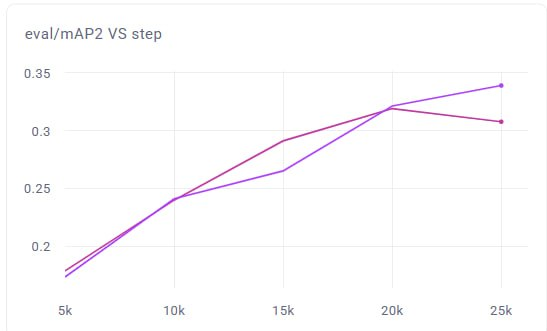

Статус артефакта: график пригоден для демонстрации применимости оптимизатора в robotics-задаче. Для использования результата как строгого приемочного benchmark необходимо получить raw logs, описание задачи, модель, датасет, определение метрики, seed, гиперпараметры оптимизатора и итоговую таблицу метрик.

## 6. ОПТ-2: матричные методы оптимизации

### 6.1. Реализация

ОПТ-2 реализован в библиотеке `brain_opt` как набор матричных и предобусловленных оптимизаторов.

Состав реализации:

- `Muon`: momentum с ортогонализацией через Newton-Schulz iterations, включая fallback на AdamW для 1D-параметров, embeddings и lm-head.
- `Shampoo`: матричное предобусловливание.
- `SOAP`: Adam в eigenbasis Shampoo.
- `get_optimizer`: общий интерфейс выбора оптимизатора.
- `LR_MULTIPLIERS`: единая шкала настройки learning rate.

Данный блок закрывает направление матричных и предобусловленных методов оптимизации, применимых к обучению и дообучению моделей с матричными параметрами.

### 6.2. Внешний robotics-результат

Команда Дмитрия Юдина выполнила запуск `AdamW` и `Muon` на задаче обучения модели для робототехники. В качестве демонстрационного артефакта предоставлен график `eval/mAP2` по шагам обучения.

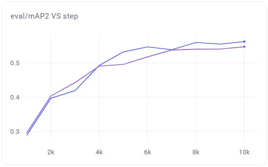

Статус артефакта аналогичен ОПТ-1: график полезен как демонстрационный результат, но для строгой приемки требуется raw export эксперимента и полная metadata запуска.

### 6.3. LM integration run для ОПТ-1 и ОПТ-2

Для независимой проверки библиотечного API подготовлен скрипт:

[`examples/opt12_lm_optimizer_benchmark.py`](../../examples/opt12_lm_optimizer_benchmark.py)

Скрипт запускает `AdamW`, `Lion` и `Muon` через `brain_opt.get_optimizer`, выполняет fine-tuning causal LM и считает downstream-метрики HellaSwag и GSM8K.

Серверный запуск выполнен на `vv_h200`:

- модель: `distilgpt2`
- число шагов fine-tuning: `100`
- число обучающих примеров: `512`
- длина последовательности: `128`
- HellaSwag samples: `200`
- GSM8K samples: `20`

Результаты:

| Optimizer | Train loss | Val loss | HellaSwag | GSM8K | Peak memory |
|---|---:|---:|---:|---:|---:|
| AdamW | `1.7814` | `5.2149` | `0.3000` | `0.0000` | `1783.8 MB` |
| Lion | `2.6557` | `7.3762` | `0.2550` | `0.0000` | `2103.7 MB` |
| Muon | `2.9208` | `8.2626` | `0.2200` | `0.0000` | `2248.2 MB` |

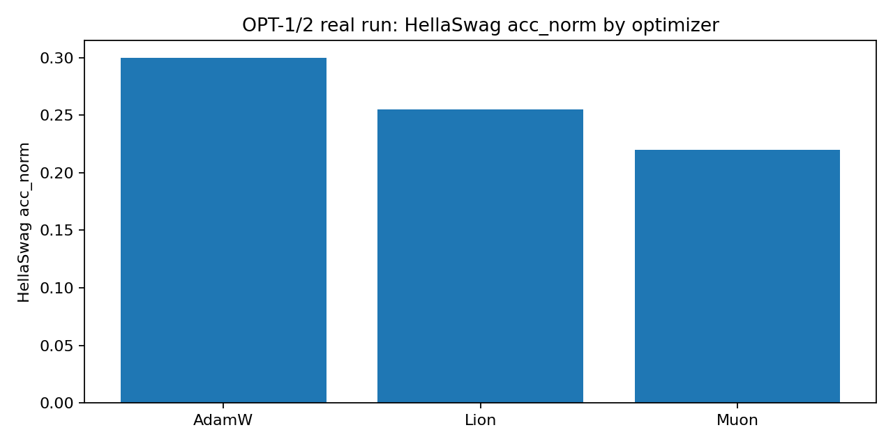

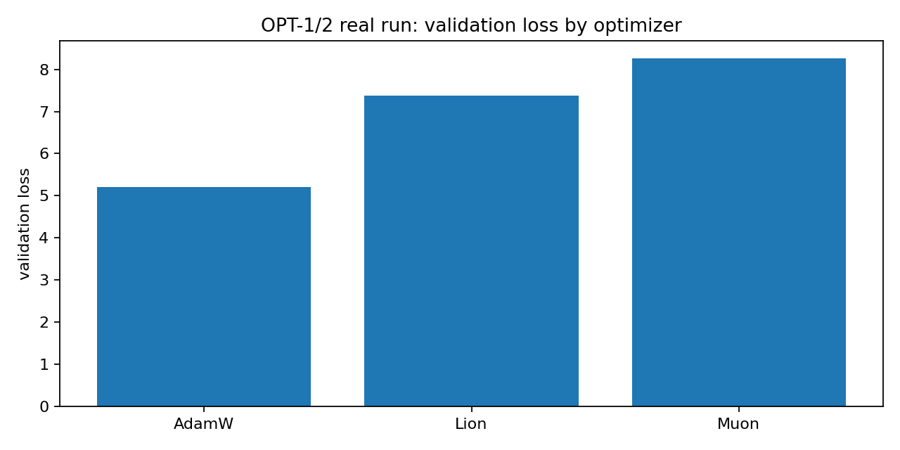

Данный запуск следует интерпретировать как integration run. Он подтверждает, что оптимизаторы корректно запускаются через общий API, метрики вычисляются, а результаты сохраняются в воспроизводимом формате. Он не является Muon-positive benchmark: на данном малом `distilgpt2` запуске лучший результат по HellaSwag показывает AdamW.

Артефакты:

- [`artifacts/opt12_lm_real_metrics.csv`](artifacts/opt12_lm_real_metrics.csv)
- [`artifacts/opt12_lm_real_summary.json`](artifacts/opt12_lm_real_summary.json)
- [`artifacts/opt12_lm_real_summary.md`](artifacts/opt12_lm_real_summary.md)
- [`artifacts/opt12_lm_real_val_loss.png`](artifacts/opt12_lm_real_val_loss.png)
- [`artifacts/opt12_lm_real_hellaswag.png`](artifacts/opt12_lm_real_hellaswag.png)
- [`artifacts/opt12_lm_real_seconds.png`](artifacts/opt12_lm_real_seconds.png)

### 6.4. A2.Pro stage для дообучения LM из checkpoint storage

Для усиления платформенной демонстрации добавлен stage `lm_finetune` в пакете [`a2pro/opt3-federated-solution`](../../a2pro/opt3-federated-solution).

Отличие от предыдущего `distilgpt2` server run состоит в источнике модели. Stage `lm_finetune` не загружает модель из Hugging Face. Он получает входную модель как `in_model` из A2.Pro checkpoint storage:

1. `client.get_checkpoint(input_name="in_model")`.
2. Локальная загрузка checkpoint через `platform_io.download_checkpoint`.
3. `AutoModelForCausalLM.from_pretrained(local_checkpoint)`.
4. Short fine-tuning для `AdamW`, `Lion` и `Muon` через `brain_opt.get_optimizer`.
5. Выбор лучшего варианта по validation loss.
6. Запись fine-tuned checkpoint в `out_model`.
7. Запись `metrics.csv`, `summary.json`, `summary.md` и графика `val_loss_by_method.png` в `out_metrics`.

Offline smoke выполнен без PlatformAPI: stage создает локальный tiny HF-compatible causal LM checkpoint и прогоняет тот же путь загрузки, дообучения и сохранения.

Результат offline smoke:

| Optimizer | Train loss | Val loss | Steps |
|---|---:|---:|---:|
| AdamW | `4.2693` | `4.2118` | `20` |
| Lion | `4.1009` | `3.9708` | `20` |
| Muon | `3.7753` | `3.7313` | `20` |

Статус: stage готов и проверен offline. Для полного платформенного подтверждения нужно загрузить HF-compatible LM checkpoint в A2.Pro, запустить `lm_finetune` на стенде и сохранить run id, output checkpoint collection id и metrics artifact id.

### 6.5. Muon-positive hard vision benchmark

Для оценки матричного оптимизатора в более благоприятной для matrix/conv-параметров постановке подготовлен скрипт:

[`examples/opt12_vision_optimizer_benchmark.py`](../../examples/opt12_vision_optimizer_benchmark.py)

Постановка: synthetic CIFAR-shaped classification в short-budget режиме. Задача имеет матрично-сверточную структуру и ближе к robotics vision setting, чем короткий LM fine-tuning.

Конфигурация:

- сервер: `vv_h200`
- seeds: `123, 124, 125, 126, 127`
- число шагов: `8`
- batch size: `64`
- число увиденных обучающих примеров на запуск: `512`
- train samples: `4096`
- validation samples: `2048`
- model width: `32`
- noise std: `0.30`
- patch strength: `0.45`
- cue strength: `0.05`
- LR grid для AdamW: `3e-4,1e-3,3e-3`
- LR grid для Lion: `1e-4,3e-4,1e-3`
- LR grid для Muon: `3e-4,1e-3,3e-3`

Средние значения по лучшему learning rate для каждого оптимизатора:

| Optimizer | Mean val accuracy | Std | Min | Max | Mean val loss |
|---|---:|---:|---:|---:|---:|
| Muon | `0.8499` | `0.1015` | `0.7480` | `0.9907` | `1.1303` |
| AdamW | `0.4245` | `0.1165` | `0.2002` | `0.5239` | `1.9646` |
| Lion | `0.2696` | `0.0597` | `0.1997` | `0.3481` | `2.2471` |

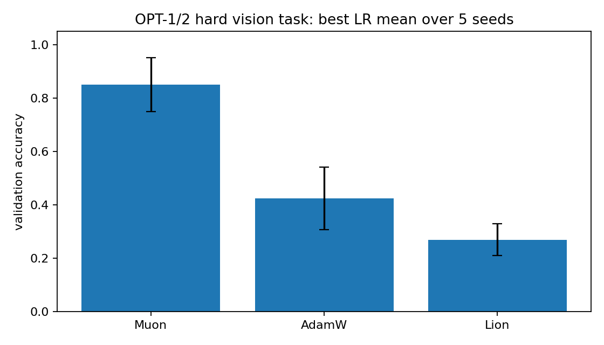

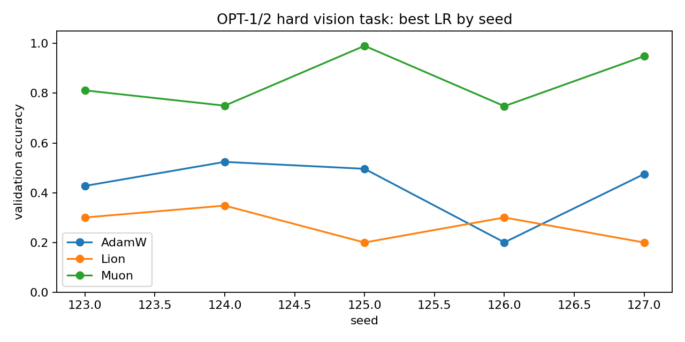

Вывод: данный эксперимент является основным положительным результатом для `Muon` в отчете. Его корректная интерпретация: controlled matrix/conv optimizer stress-test. Его не следует представлять как результат на HellaSwag или как downstream LLM benchmark.

Артефакты:

- [`artifacts/opt12_vision_hard8_all_metrics.csv`](artifacts/opt12_vision_hard8_all_metrics.csv)
- [`artifacts/opt12_vision_hard8_best_metrics.csv`](artifacts/opt12_vision_hard8_best_metrics.csv)
- [`artifacts/opt12_vision_hard8_summary.json`](artifacts/opt12_vision_hard8_summary.json)
- [`artifacts/opt12_vision_hard8_summary.md`](artifacts/opt12_vision_hard8_summary.md)
- [`artifacts/opt12_vision_hard8_mean_accuracy.png`](artifacts/opt12_vision_hard8_mean_accuracy.png)
- [`artifacts/opt12_vision_hard8_accuracy_by_seed.png`](artifacts/opt12_vision_hard8_accuracy_by_seed.png)

## 7. ОПТ-3: распределенная и федеративная оптимизация

### 7.1. Реализация

ОПТ-3 реализован в модуле `brain_opt.federated`.

Публичный API:

```python
FederatedClient
FederatedResult
FedAvgConfig
AsyncConfig
run_fedavg
run_async_sgd
run_async_local_sgd
```

Реализованные методы:

- `run_fedavg`: синхронный FedAvg с настраиваемым числом активных клиентов.
- `run_async_sgd`: асинхронный server-side SGD с задержанными клиентскими градиентами.
- `run_async_local_sgd`: асинхронный Local SGD с задержанными локальными delta-обновлениями.
- Учет `staleness` для асинхронных обновлений.
- Взвешивание обновлений по `staleness` на стороне сервера.
- Симуляция задержек через `min_delay`, `max_delay`, `max_pending`.
- Логирование истории `loss`, `step`, simulated time, `staleness` и update weight.

Проверка тестами:

```text
pytest tests/test_federated.py -q
4 passed

python -m pytest -q
19 passed
```

### 7.2. Synthetic federated demo

Скрипт:

[`examples/opt3_federated_demo.py`](../../examples/opt3_federated_demo.py)

Результаты:

- `FedAvg-5clients`: final MSE `0.001011`, improvement `11430.54x`
- `FedAvg-10clients`: final MSE `0.001032`, improvement `11201.83x`
- `FedAvg-20clients`: final MSE `0.001022`, improvement `11309.82x`
- `AsyncSGD`: final MSE `1.074178`, mean staleness `6.83`, max staleness `16`
- `Async-LocalSGD`: final MSE `0.003963`, mean staleness `6.72`, max staleness `14`

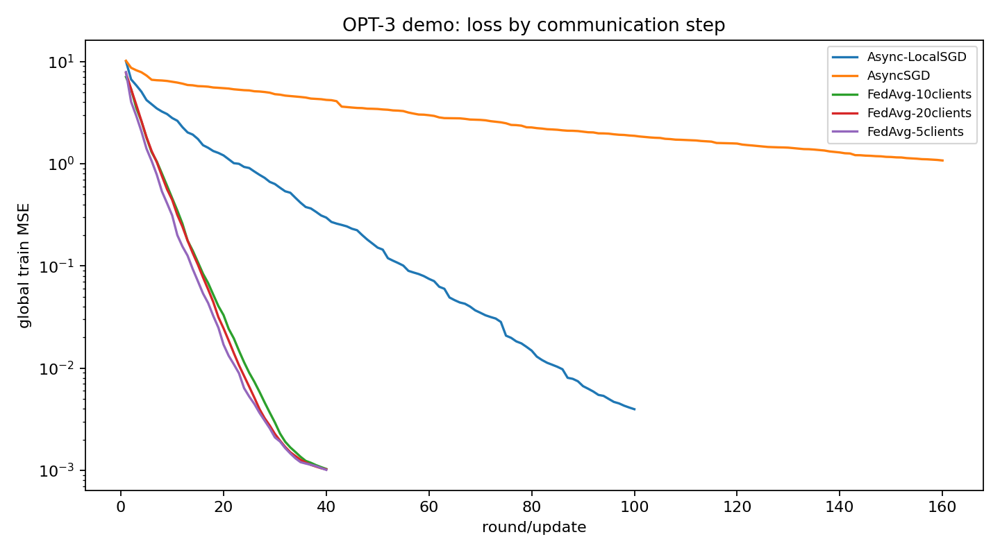

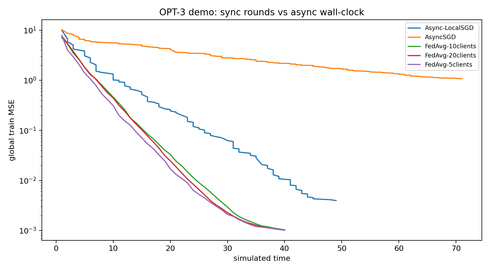

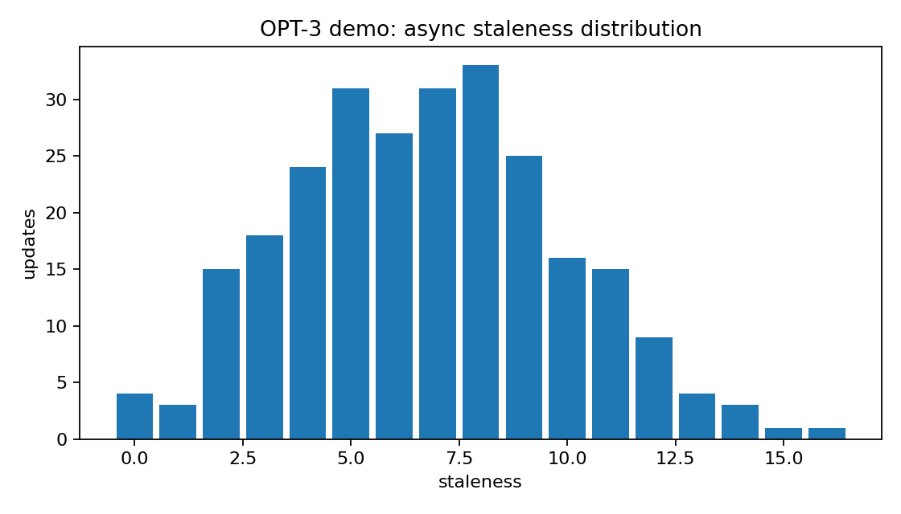

Артефакты:

- [`artifacts/opt3_metrics.csv`](artifacts/opt3_metrics.csv)
- [`artifacts/opt3_summary.json`](artifacts/opt3_summary.json)
- [`artifacts/opt3_summary.md`](artifacts/opt3_summary.md)
- [`artifacts/opt3_loss_by_step.png`](artifacts/opt3_loss_by_step.png)
- [`artifacts/opt3_loss_by_time.png`](artifacts/opt3_loss_by_time.png)
- [`artifacts/opt3_staleness_hist.png`](artifacts/opt3_staleness_hist.png)

### 7.3. CIFAR-shaped smoke demo

Дополнительно подготовлен скрипт:

[`examples/opt3_cifar_federated_demo.py`](../../examples/opt3_cifar_federated_demo.py)

Smoke-режим использует synthetic CIFAR-shaped dataset с тензорами изображений размера `3x32x32`, десятью классами, non-IID разбиением по клиентам и малой ResNet-style моделью с residual-блоками. Данный режим не требует загрузки внешних данных.

Smoke-результаты:

- `FedAvg`: final loss `1.9991`, final accuracy `0.2000`
- `AsyncSGD`: final loss `2.2726`, final accuracy `0.1000`, mean staleness `4.58`
- `Async-LocalSGD`: final loss `2.3146`, final accuracy `0.1000`, mean staleness `4.58`

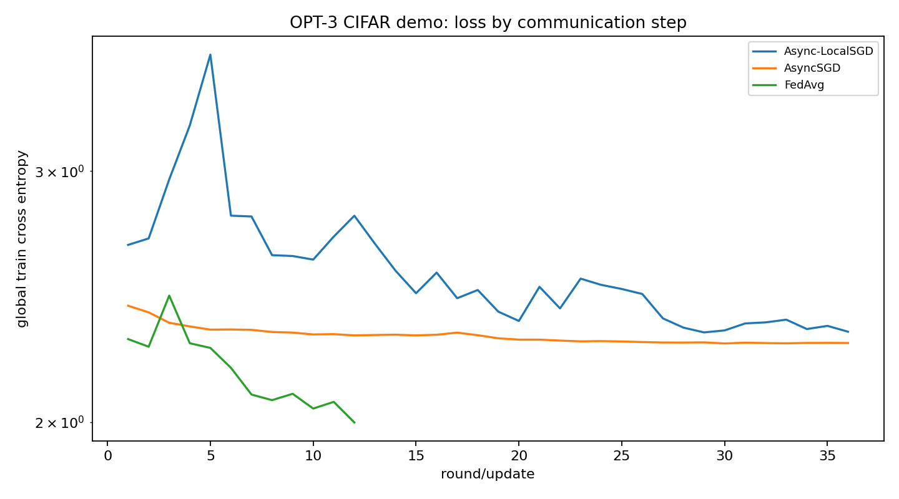

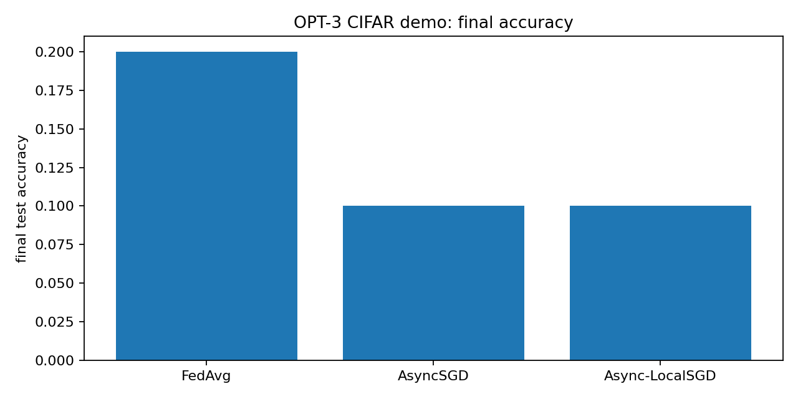

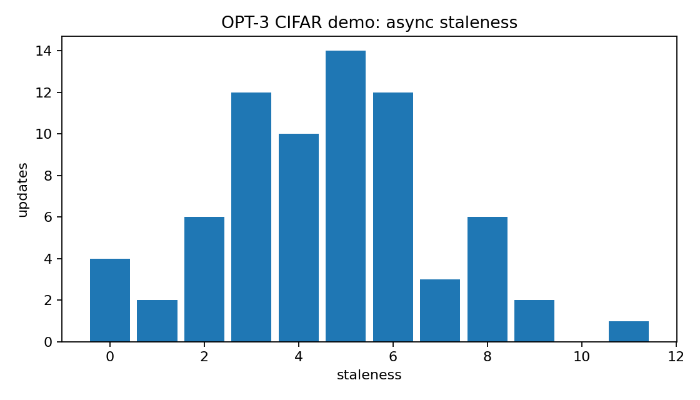

Артефакты:

- [`artifacts/opt3_cifar_smoke_metrics.csv`](artifacts/opt3_cifar_smoke_metrics.csv)
- [`artifacts/opt3_cifar_smoke_summary.json`](artifacts/opt3_cifar_smoke_summary.json)
- [`artifacts/opt3_cifar_smoke_summary.md`](artifacts/opt3_cifar_smoke_summary.md)
- [`artifacts/opt3_cifar_smoke_loss_by_step.png`](artifacts/opt3_cifar_smoke_loss_by_step.png)
- [`artifacts/opt3_cifar_smoke_final_accuracy.png`](artifacts/opt3_cifar_smoke_final_accuracy.png)
- [`artifacts/opt3_cifar_smoke_staleness_hist.png`](artifacts/opt3_cifar_smoke_staleness_hist.png)

### 7.4. CIFAR-10 server run

Серверный запуск ОПТ-3 выполнен на `vv_h200` с IID-разбиением CIFAR-10.

Конфигурация:

- dataset: CIFAR-10
- split: IID
- clients: `40`
- samples per client: `128`
- test samples: `2000`
- FedAvg rounds: `80`
- async updates: `160`
- clients per round: `10`
- local steps: `5`

Результаты:

| Method | Final loss | Final accuracy | Mean staleness |
|---|---:|---:|---:|
| FedAvg | `1.9866` | `0.2705` | n/a |
| AsyncSGD | `2.2911` | `0.1285` | `4.91` |
| Async-LocalSGD | `2.2159` | `0.1915` | `4.91` |

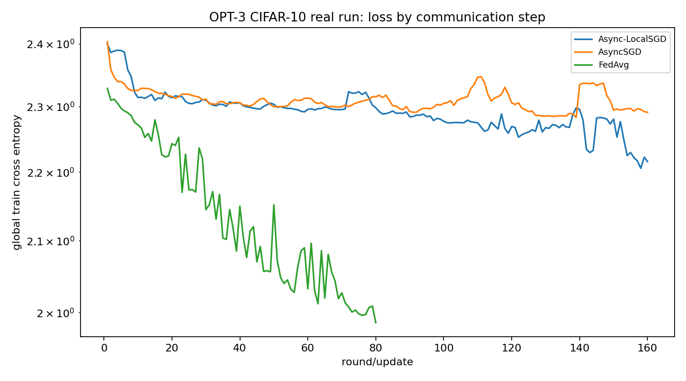

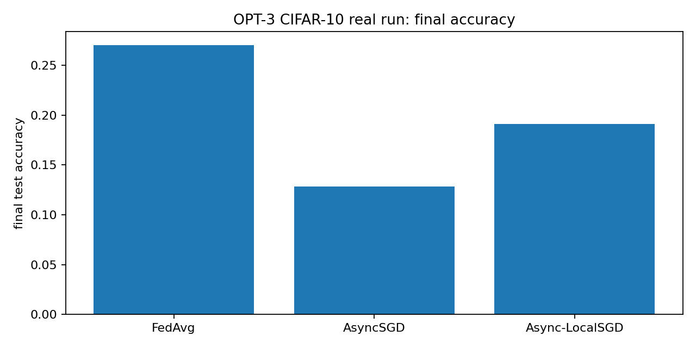

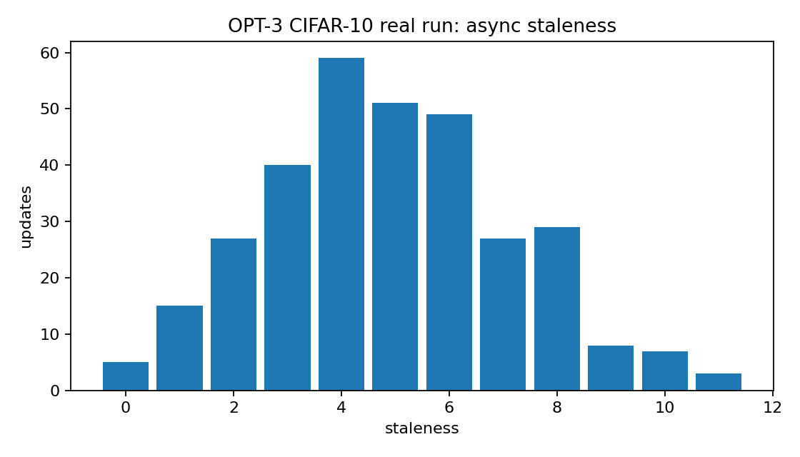

Данный запуск следует рассматривать как короткую демонстрацию работоспособности training path, сравнения методов и логирования распределенных метрик. Он не является tuned CIFAR-10 benchmark.

Артефакты:

- [`artifacts/opt3_cifar10_iid_real_metrics.csv`](artifacts/opt3_cifar10_iid_real_metrics.csv)
- [`artifacts/opt3_cifar10_iid_real_summary.json`](artifacts/opt3_cifar10_iid_real_summary.json)
- [`artifacts/opt3_cifar10_iid_real_summary.md`](artifacts/opt3_cifar10_iid_real_summary.md)
- [`artifacts/opt3_cifar10_iid_real_loss_by_step.png`](artifacts/opt3_cifar10_iid_real_loss_by_step.png)
- [`artifacts/opt3_cifar10_iid_real_final_accuracy.png`](artifacts/opt3_cifar10_iid_real_final_accuracy.png)
- [`artifacts/opt3_cifar10_iid_real_staleness_hist.png`](artifacts/opt3_cifar10_iid_real_staleness_hist.png)

### 7.5. A2.Pro Format 2 package

Для ОПТ-3 подготовлен минимальный пакет A2.Pro Format 2:

- [`../../a2pro/opt3-federated-solution/main.json`](../../a2pro/opt3-federated-solution/main.json)
- [`../../a2pro/opt3-federated-solution/stages/federated_train/stage.json`](../../a2pro/opt3-federated-solution/stages/federated_train/stage.json)
- [`../../a2pro/opt3-federated-solution/src/federated_train_main.py`](../../a2pro/opt3-federated-solution/src/federated_train_main.py)
- [`../../a2pro/opt3-federated-solution/Dockerfile`](../../a2pro/opt3-federated-solution/Dockerfile)

Stage `federated_train` использует публичный API `brain_opt` из базового образа:

```python
from brain_opt import AsyncConfig, FedAvgConfig, run_async_local_sgd, run_async_sgd, run_fedavg
```

Выходы stage:

- `out_model`: checkpoint collection с `model.pt` и `model_config.json`.
- `out_metrics`: artifact с `summary.json`, `summary.md`, `metrics.csv` и PNG-графиками.

Offline smoke-результаты:

- `FedAvg`: final loss `0.8816`, final accuracy `0.9609`
- `AsyncSGD`: final loss `2.2907`, final accuracy `0.2188`, mean staleness `4.62`
- `Async-LocalSGD`: final loss `2.0089`, final accuracy `0.2031`, mean staleness `4.62`

Sample outputs:

- [`../../a2pro/opt3-federated-solution/sample_outputs/out_metrics/summary.md`](../../a2pro/opt3-federated-solution/sample_outputs/out_metrics/summary.md)
- [`../../a2pro/opt3-federated-solution/sample_outputs/out_metrics/summary.json`](../../a2pro/opt3-federated-solution/sample_outputs/out_metrics/summary.json)
- [`../../a2pro/opt3-federated-solution/sample_outputs/out_metrics/metrics.csv`](../../a2pro/opt3-federated-solution/sample_outputs/out_metrics/metrics.csv)
- [`../../a2pro/opt3-federated-solution/sample_outputs/out_metrics/loss_by_step.png`](../../a2pro/opt3-federated-solution/sample_outputs/out_metrics/loss_by_step.png)
- [`../../a2pro/opt3-federated-solution/sample_outputs/out_metrics/final_accuracy.png`](../../a2pro/opt3-federated-solution/sample_outputs/out_metrics/final_accuracy.png)
- [`../../a2pro/opt3-federated-solution/sample_outputs/out_metrics/staleness_hist.png`](../../a2pro/opt3-federated-solution/sample_outputs/out_metrics/staleness_hist.png)

Статус: пакет готов к платформенному запуску и имеет offline smoke outputs. Stand run в A2.Pro для ОПТ-3 еще не выполнен.

### 7.6. A2.Pro stage для федеративного LM-дообучения из checkpoint storage

Для демонстрации ОПТ-3 на модели, загружаемой из A2.Pro checkpoint storage, добавлен stage `federated_lm_finetune`.

Поток выполнения:

1. Stage получает HF-compatible causal LM checkpoint как `in_model`.
2. Checkpoint скачивается локально через PlatformAPI.
3. Модель загружается через `AutoModelForCausalLM.from_pretrained(local_checkpoint)`.
4. Synthetic token-level задача делится на клиентов.
5. Запускаются `FedAvg`, `AsyncSGD` и `Async-LocalSGD` из `brain_opt.federated`.
6. Лучшая server model по validation loss сохраняется в `out_model`.
7. Метрики `train_loss`, `val_loss`, `staleness` и график `val_loss_by_method.png` сохраняются в `out_metrics`.

Offline smoke выполнен на локально созданном tiny HF-compatible checkpoint.

Результат offline smoke:

| Method | Train loss | Val loss | Steps | Mean staleness |
|---|---:|---:|---:|---:|
| FedAvg | `4.8097` | `4.8348` | `3` | n/a |
| AsyncSGD | `4.8099` | `4.8349` | `8` | `2.25` |
| Async-LocalSGD | `4.8097` | `4.8348` | `8` | `2.25` |

Статус: stage готов и проверен offline. Он усиливает интеграционную демонстрацию ОПТ-3, потому что использует входную модель из A2.Pro storage. При этом он остается single-process simulator и не заменяет реальный multi-device runtime.

## 8. ОПТ-4: эффективное хранение больших моделей через квантизацию

### 8.1. Реализация

ОПТ-4 реализован двумя слоями:

- `a2_kvant`: Python-библиотека квантизации.
- A2.Pro stage `quantize`: PlatformAPI-обвязка над `a2_kvant`.

В демонстрации отчета используется один рецепт:

- `w4a16`: GPTQ INT4 weights и FP16 activations.

Поток выполнения stage:

1. Чтение параметров через PlatformAPI.
2. Получение входного checkpoint `in_model`.
3. Загрузка весов модели в локальное окружение.
4. Запуск `a2_kvant.quantize.quantize_model`.
5. Создание `out_model` как checkpoint collection.
6. Загрузка квантованного checkpoint.
7. Запись `out_metrics` как artifact.
8. Публикация progress state.

### 8.2. Основная демонстрация `>2x`: Qwen2.5-Math-1.5B из A2.Pro storage

Модель: `Qwen2.5-Math-1.5B`

Источник модели: checkpoint, выгруженный из A2.Pro storage в архив `qwen2.5-math-1.5b.zip`.

Рецепт: `w4a16`, GPTQ INT4 weights и FP16 activations.

Результаты:

| Metric | FP16 | W4A16 |
|---|---:|---:|
| Weight file size | `2.875 GiB` | `1.064 GiB` |
| Directory disk size | `2.886 GiB` | `1.079 GiB` |
| Compression ratio by weights | `1.00x` | `2.70x` |
| Size reduction by weights | `0.0%` | `63.0%` |
| WikiText-2 perplexity | `23.884` | `24.802` |
| Generation speed, HF eval | `20.47 tok/s` | `28.30 tok/s` |
| Mean latency, HF eval | `3663.31 ms` | `3251.29 ms` |

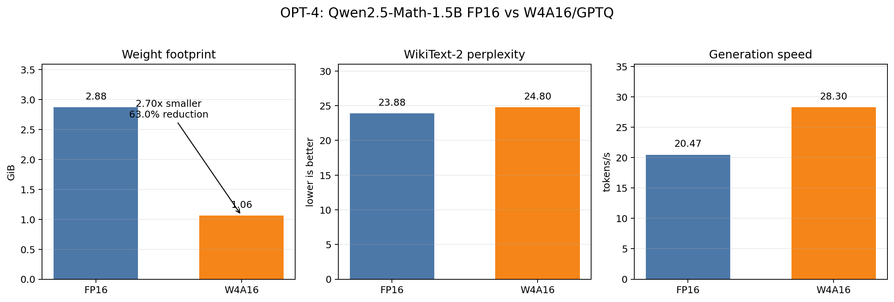

Артефакты:

- [`artifacts/opt4_qwen25_math_fp16_report.json`](artifacts/opt4_qwen25_math_fp16_report.json)
- [`artifacts/opt4_qwen25_math_w4a16_report.json`](artifacts/opt4_qwen25_math_w4a16_report.json)
- [`artifacts/opt4_qwen25_math_w4a16_compare.json`](artifacts/opt4_qwen25_math_w4a16_compare.json)
- [`artifacts/opt4_qwen25_math_w4a16_comparison.png`](artifacts/opt4_qwen25_math_w4a16_comparison.png)

Интерпретация: W4A16/GPTQ снижает размер файла весов с `3,087,467,144` до `1,142,692,360` байт. Коэффициент сжатия равен `2.70x`, экономия равна `63.0%`. Это закрывает требование о снижении ресурсных затрат не менее чем в 2 раза в части хранения checkpoint и footprint весов модели. На коротком quality-прогоне WikiText-2 perplexity ухудшается на `3.84%`, при этом скорость генерации в HF evaluation увеличивается на `38.2%`.

Видеопамять, измеренная через HF loader, не используется как основной ресурсный claim для W4A16. В этом режиме loader частично распаковывает compressed tensors при оценке. Поэтому основной приемочный показатель для данной демонстрации, размер checkpoint и footprint весов. Отдельный serving-прогон через vLLM можно использовать как дополнительную проверку peak VRAM, если приемка потребует именно runtime VRAM.

## 9. Демонстрационный сценарий

### ОПТ-1

Для демонстрации следует показать:

- библиотеку `brain_opt` как единый интерфейс drop-in оптимизаторов;
- stage `lm_finetune`, где входная LM берется из A2.Pro `in_model`, а выходная дообученная модель сохраняется в `out_model`;
- внешний график `Lion vs AdamW` на robotics-задаче;
- LM integration run, где `AdamW`, `Lion` и `Muon` запускаются одним скриптом и сохраняют HellaSwag/GSM8K metrics;
- hard vision stress-test как независимую проверку optimizer-пайплайна.

### ОПТ-2

Для демонстрации следует показать:

- наличие `Muon`, `Shampoo` и `SOAP` в библиотеке `brain_opt`;
- stage `lm_finetune`, где `Muon` может запускаться на входной LM из checkpoint storage через тот же API;
- внешний график `Muon vs AdamW` на robotics-задаче;
- hard vision benchmark, где `Muon` достигает mean validation accuracy `0.8499` против `0.4245` у `AdamW` и `0.2696` у `Lion`.

### ОПТ-3

Для демонстрации следует показать:

- API `brain_opt.federated`;
- synthetic demo для `FedAvg`, `AsyncSGD` и `Async-LocalSGD`;
- CIFAR-10 server run на `vv_h200`;
- A2.Pro Format 2 package `federated_train`;
- A2.Pro stage `federated_lm_finetune`, который читает LM из `in_model` и сохраняет federated fine-tuned server model в `out_model`;
- sample outputs `out_model` и `out_metrics`.

При демонстрации ОПТ-3 необходимо явно указать, что текущая реализация является single-process simulator и не является завершенным multi-device runtime.

### ОПТ-4

Для демонстрации следует показать:

- Qwen2.5-Math-1.5B FP16 vs W4A16 benchmark на checkpoint из A2.Pro storage;
- compression ratio `2.7019`, reduction `62.99%`;
- график [`artifacts/opt4_qwen25_math_w4a16_comparison.png`](artifacts/opt4_qwen25_math_w4a16_comparison.png);
- сводный artifact [`artifacts/opt4_qwen25_math_w4a16_compare.json`](artifacts/opt4_qwen25_math_w4a16_compare.json);
- PlatformAPI path stage `quantize` для чтения checkpoint, записи checkpoint collection и записи metrics artifact.

## 10. Ограничения и оставшиеся работы

1. Для ОПТ-1 и ОПТ-2 требуется получить у команды, выполнявшей robotics-запуски, raw logs, конфигурации и итоговые таблицы по `AdamW`, `Lion` и `Muon`. Без этих данных robotics-графики следует использовать как демонстрационные артефакты, а не как строгие приемочные benchmark-результаты.
2. Для ОПТ-1/2 требуется выполнить stand run A2.Pro для stage `lm_finetune` на загруженном HF-compatible checkpoint, сохранить run id, output checkpoint id и metrics artifact id.
3. Для ОПТ-3 требуется выполнить stand run A2.Pro для stages `federated_train` и `federated_lm_finetune`, сохранить run id, output checkpoint id и metrics artifact id.
4. Для ОПТ-3 требуется отдельно решить вопрос о необходимости реального multi-device launcher. Если п. 3.5.2.1 трактуется строго, single-process simulator недостаточен.
5. Для ОПТ-4 ресурсный критерий `>2x` закрыт по размеру checkpoint и footprint весов. Если приемка будет требовать именно peak VRAM в serving runtime, нужен отдельный vLLM-прогон W4A16 на том же checkpoint.
6. Pruning в рамках текущей реализации ОПТ-4 не реализован. Текущий delivered scope покрывает post-training quantization через `GPTQ W4A16`.

## 11. Итоговое заключение

ОПТ-1, ОПТ-2, ОПТ-3 и ОПТ-4 оформлены как Python-библиотеки или библиотечно-платформенные компоненты и могут вызываться из базового образа A2.Pro.

ОПТ-1 и ОПТ-2 закрывают библиотечную реализацию оптимизаторов для обучения и дообучения моделей. Для них подготовлены внешний robotics signal, LM integration run, независимый vision stress-test и stage `lm_finetune`, который дообучает LM, загруженную из A2.Pro checkpoint storage. Основной положительный результат для `Muon` получен на controlled matrix/conv vision benchmark.

ОПТ-3 закрывает алгоритмическую часть федеративной и асинхронной оптимизации на уровне simulator, воспроизводимых demo-запусков и A2.Pro Format 2 package. Дополнительно добавлен stage `federated_lm_finetune`, который применяет FedAvg, AsyncSGD и Async-LocalSGD к LM checkpoint из A2.Pro storage. Строгая multi-device проверка и stand run остаются следующими шагами.

ОПТ-4 закрывает эффективное хранение больших моделей через post-training quantization. Основной ресурсный результат получен на checkpoint `Qwen2.5-Math-1.5B` из A2.Pro storage: W4A16/GPTQ уменьшает файл весов в `2.70x`, что соответствует экономии `63.0%`. Pruning остается вне текущего подтвержденного результата.

С учетом этих ограничений отчет корректно закрывает текущий демонстрационный статус ПМ `A2.Оптимизация` и показывает, какие пункты ТЗ реализованы полностью, а какие требуют дополнительного платформенного или экспериментального подтверждения.
