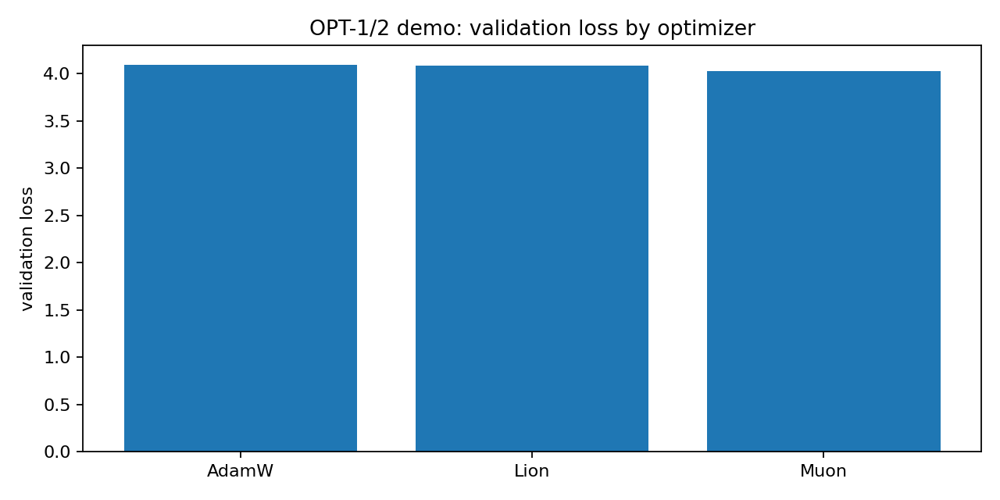

# A2.Pro optimization report

Date: 2026-07-12

This report covers OPT-1, OPT-2, OPT-3 and OPT-4. The goal is to show what is implemented, what was demonstrated, and which points of the technical requirements are already closed.

The report is GitHub-ready. All images and data files are stored under `artifacts/`, and all image links are relative.

## Summary

OPT-1 and OPT-2 are implemented in `brain_opt` as a Python optimizer library. There is external evidence from Dmitry Yudin's team on a robotics training task, but the raw logs and exact task description are not in this repository yet.

OPT-3 is implemented in `brain_opt==0.2.0` as a single-process federated optimization simulator. It has a reproducible demo with CSV, JSON, Markdown summary and plots. It also has a minimal A2.Pro Format 2 package that calls `brain_opt` from the base image and writes `out_model` plus `out_metrics`.

OPT-4 is implemented as the `a2_kvant` Python library and as the A2.Pro `quantize` stage. It has two demonstrations: a Qwen3-8B benchmark with resource and quality metrics, and a completed A2.Pro stand run that writes a quantized checkpoint and metrics artifact.

Main caveat: OPT-3 is currently a simulator, not a real multi-device distributed runtime. The A2.Pro package has been smoke-tested offline, but it has not yet been executed on the stand.

## Technical requirements checked

The mapping below is based on these documents:

- `ТЗ 4 Платформа Сгибнев.pdf`, point 3.2.3.7: `A2.Оптимизация` must implement at least one method for optimization, distributed optimization modifications, and efficient storage of large models.
- `3 Дополнение к ТЗ Безносиков`, point 2.5: efficient adaptive optimization, efficient distributed optimization, specialized optimization tasks, and benchmark evaluation.
- `3 Дополнение к ТЗ Безносиков`, points 3.4 and 3.5: experimental code must be delivered as a component, module or library, with configs, logs, metrics and result tables.
- `3 Дополнение к ТЗ Безносиков`, point 3.5.2.1: distributed training components target synchronous or asynchronous training on one or more clusters with more than one device.
- `3 Дополнение к ТЗ Безносиков`, point 3.5.2.6: components must work inside A2.Pro `Оптимизация`.
- `3 Дополнение к ТЗ Безносиков`, point 3.7.2: tests should include baseline comparison, quality metrics and resource metrics where applicable.
- `ТЗ 3 Безносиков.pdf`, point 3.2: quantization and pruning methods based on optimization formulations.
- `ТЗ 3 Безносиков.pdf`, point 3.3: training procedures with quantization.

## Base image integration

The integration design is aligned with the request to call optimization methods from the base image.

The base image `plibs:jaguar-a2pro-optlibs` includes:

- `brain_opt==0.2.0`
- `a2_kvant==0.1.0`

The A2.Pro solution image uses `QUANT_LIB_SOURCE=base` by default. In that mode the image removes local `/app/src/a2_kvant` and checks that imports resolve from the base image:

```python
import a2_kvant
import brain_opt
from brain_opt import get_optimizer, run_fedavg
```

This is the right integration path: the solution code contains the PlatformAPI wrapper, while the optimization methods live in the base image.

The OPT-3 A2.Pro package is stored at [`../../a2pro/opt3-federated-solution`](../../a2pro/opt3-federated-solution). Its Dockerfile fails early if `brain_opt` is missing from the base image:

```python
from brain_opt import run_fedavg, run_async_sgd, run_async_local_sgd
```

Current limitation: the completed stand run proves OPT-4 and the base-library path. OPT-3 now has a Format 2 package and offline smoke outputs, but still needs one stand run to prove the UI/runtime path.

## OPT-1: memory-efficient optimizers

Current mapping: OPT-1 is the memory-efficient and adaptive optimizer block.

Implemented in `brain_opt`:

- `SGD`, baseline re-export
- `AdamW`, baseline re-export
- `SignSGD`, sign-based SGD and Signum
- `Lion`, EvoLved Sign Momentum
- `get_optimizer`, common factory
- `scale_lr` and `LR_MULTIPLIERS`, common learning-rate interface

Why this matches the requirements:

- Covers the `ТЗ 4`, point 3.2.3.7 direction on optimization methods for LLM and MLLM training or fine-tuning.
- Covers the supplement, point 2.5, on efficient adaptive optimization techniques.
- Covers the supplement, point 3.4, as an experimental code sample in library form.

### External robotics result

The user reported that Dmitry Yudin's team ran AdamW and Lion on a robotics model-training task. The plot below was supplied as evidence. It shows `eval/mAP2 vs step`.


Status of this evidence:

- Useful as a demonstration slide.
- Not enough for a strict report yet because the plot has no legend, no raw logs, no model name, no dataset name and no exact command.
- To make it acceptance-ready, we should request the raw metric export or at least the run names, task description, model, dataset, seed, optimizer hyperparameters and final metric table.

## OPT-2: matrix optimizers

Current mapping: OPT-2 is the matrix and preconditioned optimizer block.

Implemented in `brain_opt`:

- `Muon`, Newton-Schulz orthogonalized momentum with AdamW fallback for 1D parameters, embeddings and lm-head
- `Shampoo`, matrix preconditioning
- `SOAP`, Adam in Shampoo eigenbasis
- `get_optimizer`, common factory
- `LR_MULTIPLIERS`, common learning-rate interface

Why this matches the requirements:

- Covers the `ТЗ 4`, point 3.2.3.7 direction on optimization methods for training and fine-tuning.
- Covers the supplement, point 2.5, on efficient optimization approaches for different training setups.
- Covers the supplement, points 3.4 and 3.5, as a Python library component.

### External robotics result

The user reported that Dmitry Yudin's team ran AdamW and Muon on a robotics model-training task. The plot below was supplied as evidence. It shows `eval/mAP2 vs step`.


Status of this evidence:

- Useful as a demonstration slide.
- Not enough for a strict report yet because the plot has no legend, no raw logs, no model name, no dataset name and no exact command.
- To make it acceptance-ready, we need the same metadata as for OPT-1.

### Independent LM benchmark script

I added a standalone script for an independent OPT-1/2 run:

```bash
python examples/opt12_lm_optimizer_benchmark.py \
  --smoke \
  --steps 12 \
  --batch-size 8 \
  --seq-len 48 \
  --out-dir runs/opt12_lm_optimizer_benchmark_smoke
```

Smoke artifacts:

- [`artifacts/opt12_lm_smoke_metrics.csv`](artifacts/opt12_lm_smoke_metrics.csv)
- [`artifacts/opt12_lm_smoke_summary.json`](artifacts/opt12_lm_smoke_summary.json)
- [`artifacts/opt12_lm_smoke_summary.md`](artifacts/opt12_lm_smoke_summary.md)
- [`artifacts/opt12_lm_smoke_val_loss.png`](artifacts/opt12_lm_smoke_val_loss.png)

Smoke result:

- `AdamW`: train loss `4.1023`, val loss `4.0944`
- `Lion`: train loss `4.0915`, val loss `4.0822`
- `Muon`: train loss `4.0409`, val loss `4.0308`



This smoke run proves that the same script can train with AdamW, Lion and Muon through the `brain_opt` API. It is not a benchmark claim.

The real HellaSwag command is:

```bash
python examples/opt12_lm_optimizer_benchmark.py \
  --model distilgpt2 \
  --dataset wikitext \
  --dataset-config wikitext-2-raw-v1 \
  --dataset-split train \
  --max-train-samples 1024 \
  --steps 500 \
  --batch-size 4 \
  --seq-len 256 \
  --optimizers AdamW Lion Muon \
  --hellaswag-samples 1000 \
  --out-dir runs/opt12_lm_optimizer_benchmark_real
```

Optional GSM8K smoke can be added with:

```bash
--gsm8k-samples 100
```

Local note: a tiny real-mode check with Hugging Face downloads was attempted on this machine and was stopped because the process waited on external model or dataset loading. The script itself was validated through the no-download smoke path.

### Real server run

The real OPT-1/2 run was executed on `vv_h200` with `distilgpt2`, `100` fine-tuning steps, `200` HellaSwag validation examples and `20` GSM8K examples.

Artifacts:

- [`artifacts/opt12_lm_real_metrics.csv`](artifacts/opt12_lm_real_metrics.csv)
- [`artifacts/opt12_lm_real_summary.json`](artifacts/opt12_lm_real_summary.json)
- [`artifacts/opt12_lm_real_summary.md`](artifacts/opt12_lm_real_summary.md)
- [`artifacts/opt12_lm_real_val_loss.png`](artifacts/opt12_lm_real_val_loss.png)
- [`artifacts/opt12_lm_real_hellaswag.png`](artifacts/opt12_lm_real_hellaswag.png)
- [`artifacts/opt12_lm_real_seconds.png`](artifacts/opt12_lm_real_seconds.png)

Results:

- `AdamW`: train loss `1.7814`, val loss `5.2149`, HellaSwag `0.3000`, GSM8K `0.0000`, peak memory `1783.8 MB`
- `Lion`: train loss `2.6557`, val loss `7.3762`, HellaSwag `0.2550`, GSM8K `0.0000`, peak memory `2103.7 MB`
- `Muon`: train loss `2.9208`, val loss `8.2626`, HellaSwag `0.2200`, GSM8K `0.0000`, peak memory `2248.2 MB`


This is a small server run, not a final benchmark. It is still useful because it exercises the full path: fine-tuning with each optimizer, then downstream evaluation.

## OPT-3: federated and distributed optimization

Implemented in `brain_opt.federated`.

Public API:

```python
FederatedClient
FederatedResult
FedAvgConfig
AsyncConfig
run_fedavg
run_async_sgd
run_async_local_sgd
```

Implemented methods:

- `run_fedavg`: synchronous FedAvg with configurable active client count
- `run_async_sgd`: asynchronous server-side SGD with delayed client gradients
- `run_async_local_sgd`: asynchronous Local SGD with delayed local deltas
- staleness tracking for async updates
- staleness weighting on the server
- simulated latency through `min_delay`, `max_delay` and `max_pending`
- history logging for loss, step, simulated time, staleness and update weight

Verification:

```text
pytest tests/test_federated.py -q
4 passed

python -m pytest -q
19 passed
```

### Demo

Demo script:

```bash
python examples/opt3_federated_demo.py
```

Demo artifacts:

- [`artifacts/opt3_metrics.csv`](artifacts/opt3_metrics.csv)
- [`artifacts/opt3_summary.json`](artifacts/opt3_summary.json)
- [`artifacts/opt3_summary.md`](artifacts/opt3_summary.md)
- [`artifacts/opt3_loss_by_step.png`](artifacts/opt3_loss_by_step.png)
- [`artifacts/opt3_loss_by_time.png`](artifacts/opt3_loss_by_time.png)
- [`artifacts/opt3_staleness_hist.png`](artifacts/opt3_staleness_hist.png)

Results:

- `FedAvg-5clients`: final MSE `0.001011`, improvement `11430.54x`
- `FedAvg-10clients`: final MSE `0.001032`, improvement `11201.83x`
- `FedAvg-20clients`: final MSE `0.001022`, improvement `11309.82x`
- `AsyncSGD`: final MSE `1.074178`, mean staleness `6.83`, max staleness `16`
- `Async-LocalSGD`: final MSE `0.003963`, mean staleness `6.72`, max staleness `14`


### CIFAR-shaped federated demo

I added a second OPT-3 script focused on the distributed-training requirement:

```bash
python examples/opt3_cifar_federated_demo.py \
  --dataset synthetic \
  --clients 16 \
  --samples-per-client 24 \
  --test-samples 240 \
  --rounds 12 \
  --updates 36 \
  --clients-per-round 6 \
  --local-steps 3 \
  --batch-size 12 \
  --model-width 8 \
  --lr 0.08 \
  --async-lr 0.04 \
  --out-dir runs/opt3_cifar_federated_demo_smoke
```

This default smoke mode uses a synthetic CIFAR-shaped dataset. It has image tensors of shape `3x32x32`, ten classes, non-IID client splits, and a small ResNet-style model with residual blocks. It runs without downloads.

Smoke artifacts:

- [`artifacts/opt3_cifar_smoke_metrics.csv`](artifacts/opt3_cifar_smoke_metrics.csv)
- [`artifacts/opt3_cifar_smoke_summary.json`](artifacts/opt3_cifar_smoke_summary.json)
- [`artifacts/opt3_cifar_smoke_summary.md`](artifacts/opt3_cifar_smoke_summary.md)
- [`artifacts/opt3_cifar_smoke_loss_by_step.png`](artifacts/opt3_cifar_smoke_loss_by_step.png)
- [`artifacts/opt3_cifar_smoke_final_accuracy.png`](artifacts/opt3_cifar_smoke_final_accuracy.png)
- [`artifacts/opt3_cifar_smoke_staleness_hist.png`](artifacts/opt3_cifar_smoke_staleness_hist.png)

Smoke result:

- `FedAvg`: final loss `1.9991`, final accuracy `0.2000`
- `AsyncSGD`: final loss `2.2726`, final accuracy `0.1000`, mean staleness `4.58`
- `Async-LocalSGD`: final loss `2.3146`, final accuracy `0.1000`, mean staleness `4.58`


For the real CIFAR-10 run:

```bash
python examples/opt3_cifar_federated_demo.py \
  --dataset cifar10 \
  --download \
  --clients 40 \
  --samples-per-client 64 \
  --test-samples 2000 \
  --rounds 50 \
  --updates 150 \
  --clients-per-round 10 \
  --local-steps 4 \
  --batch-size 32 \
  --model-width 16 \
  --lr 0.05 \
  --async-lr 0.02 \
  --out-dir runs/opt3_cifar_federated_demo_cifar10
```

### Real CIFAR-10 server run

The real OPT-3 CIFAR-10 run was executed on `vv_h200` with IID client splits, `40` clients, `80` FedAvg rounds, `160` async updates and `2000` test examples.

Artifacts:

- [`artifacts/opt3_cifar10_iid_real_metrics.csv`](artifacts/opt3_cifar10_iid_real_metrics.csv)
- [`artifacts/opt3_cifar10_iid_real_summary.json`](artifacts/opt3_cifar10_iid_real_summary.json)
- [`artifacts/opt3_cifar10_iid_real_summary.md`](artifacts/opt3_cifar10_iid_real_summary.md)
- [`artifacts/opt3_cifar10_iid_real_loss_by_step.png`](artifacts/opt3_cifar10_iid_real_loss_by_step.png)
- [`artifacts/opt3_cifar10_iid_real_final_accuracy.png`](artifacts/opt3_cifar10_iid_real_final_accuracy.png)
- [`artifacts/opt3_cifar10_iid_real_staleness_hist.png`](artifacts/opt3_cifar10_iid_real_staleness_hist.png)

Results:

- `FedAvg`: final loss `1.9866`, final accuracy `0.2705`
- `AsyncSGD`: final loss `2.2911`, final accuracy `0.1285`, mean staleness `4.91`
- `Async-LocalSGD`: final loss `2.2159`, final accuracy `0.1915`, mean staleness `4.91`


This is a short demonstration run. It shows that the code trains a CIFAR-10 model and logs distributed-method metrics. It is not a tuned CIFAR-10 benchmark.

### A2.Pro stage package

I added a minimal Format 2 package for OPT-3:

- [`../../a2pro/opt3-federated-solution/main.json`](../../a2pro/opt3-federated-solution/main.json)
- [`../../a2pro/opt3-federated-solution/stages/federated_train/stage.json`](../../a2pro/opt3-federated-solution/stages/federated_train/stage.json)
- [`../../a2pro/opt3-federated-solution/src/federated_train_main.py`](../../a2pro/opt3-federated-solution/src/federated_train_main.py)
- [`../../a2pro/opt3-federated-solution/Dockerfile`](../../a2pro/opt3-federated-solution/Dockerfile)

The stage calls the same `brain_opt` public API from the base image, not a local algorithm copy:

```python
from brain_opt import AsyncConfig, FedAvgConfig, run_async_local_sgd, run_async_sgd, run_fedavg
```

Offline smoke command:

```bash
FEDERATED_OFFLINE=1 PYTHONPATH=src:/path/to/brain-opt python src/federated_train_main.py
```

Sample outputs:

- [`../../a2pro/opt3-federated-solution/sample_outputs/out_metrics/summary.md`](../../a2pro/opt3-federated-solution/sample_outputs/out_metrics/summary.md)
- [`../../a2pro/opt3-federated-solution/sample_outputs/out_metrics/summary.json`](../../a2pro/opt3-federated-solution/sample_outputs/out_metrics/summary.json)
- [`../../a2pro/opt3-federated-solution/sample_outputs/out_metrics/metrics.csv`](../../a2pro/opt3-federated-solution/sample_outputs/out_metrics/metrics.csv)
- [`../../a2pro/opt3-federated-solution/sample_outputs/out_metrics/loss_by_step.png`](../../a2pro/opt3-federated-solution/sample_outputs/out_metrics/loss_by_step.png)
- [`../../a2pro/opt3-federated-solution/sample_outputs/out_metrics/final_accuracy.png`](../../a2pro/opt3-federated-solution/sample_outputs/out_metrics/final_accuracy.png)
- [`../../a2pro/opt3-federated-solution/sample_outputs/out_metrics/staleness_hist.png`](../../a2pro/opt3-federated-solution/sample_outputs/out_metrics/staleness_hist.png)

Smoke result:

- `FedAvg`: final loss `0.8816`, final accuracy `0.9609`
- `AsyncSGD`: final loss `2.2907`, final accuracy `0.2188`, mean staleness `4.62`
- `Async-LocalSGD`: final loss `2.0089`, final accuracy `0.2031`, mean staleness `4.62`

Requirement mapping:

- Closes `ТЗ 4`, point 3.2.3.7, for distributed optimization modifications at simulator level.
- Closes the supplement, point 2.5, for efficient distributed optimization methods at simulator level.
- Closes the supplement, point 3.4, as experimental Python code.
- Closes the supplement, point 3.5.2.6 at integration-package level: OPT-3 is callable as an A2.Pro stage and writes platform outputs.
- Partially closes the supplement, point 3.7.2, because the demo compares FedAvg, AsyncSGD and Async-LocalSGD by loss, simulated time and staleness.

What is not fully closed:

- It does not satisfy the strict reading of point 3.5.2.1 if actual multi-device training is required.
- The new script has a real CIFAR-10 server run, but it is still single-process simulation, not multi-device training.
- The A2.Pro stage has an offline smoke run, but not yet a completed stand run.

## OPT-4: efficient storage through quantization

Implemented as:

- `a2_kvant`, Python quantization library
- A2.Pro `quantize` stage, PlatformAPI wrapper around `a2_kvant`
- base-image integration through `a2_kvant==0.1.0`

Recipes:

- `w8a8`: SmoothQuant plus GPTQ, INT8 weights and INT8 activations
- `w4a16`: GPTQ INT4 weights and FP16 activations
- `fp8`: FP8 dynamic weights and activations

The A2.Pro stage flow:

- reads parameters from PlatformAPI
- gets input checkpoint `in_model`
- downloads model files
- runs `a2_kvant.quantize.quantize_model`
- creates output checkpoint collection `out_model`
- uploads the quantized checkpoint
- writes `out_metrics` as an artifact
- publishes stage progress

### Demo 1: Qwen3-8B benchmark

Model: `Qwen/Qwen3-8B`

Recipe: `w8a8`

Artifacts:

- [`artifacts/opt4_run_config.json`](artifacts/opt4_run_config.json)
- [`artifacts/opt4_compare_vllm.json`](artifacts/opt4_compare_vllm.json)
- [`artifacts/opt4_qwen3_w8a8_comparison.png`](artifacts/opt4_qwen3_w8a8_comparison.png)

Results:

- FP16 disk size: `15.26 GiB`
- W8A8 disk size: `8.79 GiB`
- FP16 VRAM for weights: `15.27 GiB`
- W8A8 VRAM for weights: `8.80 GiB`
- FP16 generation speed: `78.16 tok/s`
- W8A8 generation speed: `114.02 tok/s`
- FP16 WikiText-2 perplexity: `8.622`
- W8A8 WikiText-2 perplexity: `8.533`
- FP16 HellaSwag acc_norm: `0.7500`
- W8A8 HellaSwag acc_norm: `0.7542`
- FP16 GSM8K strict: `0.906`
- W8A8 GSM8K strict: `0.910`


### Demo 2: A2.Pro stand run

Stand run metadata:

- run: `61af8071-adb5-4dbe-8c06-8200bfba3c66`
- project: `3d07ae35-3d92-4af5-ba0d-732f00664959`
- experiment: `58d8b9cc-6d23-4cc5-9136-832cb52e76a7`
- stage: `295120f3-ef63-4c37-9240-832a462eeb8b`
- image: `a2pro-quantization:v1.0.16-base-optlibs`
- input checkpoint: `172aabea-8fac-4c41-a17a-0824ddc57170`
- output checkpoint collection: `0b535f00-85fa-414c-af27-9efe8a6ad9c7`
- metrics artifact: `dbbf6083-1224-4159-a450-c1a9a4fdd65c`

Metrics:

- input size: `2.8861 GiB`
- output disk size: `1.6671 GiB`
- compression ratio: `1.7312`

Artifact:

- [`artifacts/opt4_stand_metrics.json`](artifacts/opt4_stand_metrics.json)

Internal stand API link:

```text
https://10.0.116.16:31885/api/v1.10/runs/61af8071-adb5-4dbe-8c06-8200bfba3c66/
```

What the stand run proves:

- RustFS and PlatformAPI checkpoint read blocker did not reproduce.
- Stage read the input checkpoint.
- Stage quantized the model.
- Stage uploaded a new checkpoint collection.
- Stage wrote a metrics artifact.
- Run finished with `COMPLETED` and progress `100`.

Known limitation:

The stand run caught evaluation as `evaluation_error`:

```text
HfUriError: Invalid HF URI 'hf://datasets/wikitext@b08601e04326c79dfdd32d625aee71d232d685c3/.huggingface.yaml'
```

The run proves quantization, checkpoint IO and resource metrics. It does not provide a clean stand-side perplexity metric yet. To fix this, rebuild the base image with the updated `a2_kvant` wheel and rerun.

Requirement mapping:

- Closes `ТЗ 4`, point 3.2.3.7, for efficient storage of large models.
- Closes `ТЗ 3`, point 3.2, for quantization based on optimization formulations.
- Closes the supplement, point 3.5.2.6, through the A2.Pro Format 2 stage.
- Closes the supplement, point 3.7.2, for resource metrics.
- Closes quality metrics in the Qwen3-8B benchmark, but only partially on the stand because of the evaluation error.

What is not fully closed:

- Pruning is not implemented.
- `ТЗ 3`, point 3.3, is only partially covered. Current code does post-training quantization, not quantization inside the training loop.

## What to show

For OPT-1:

- Show the Lion vs AdamW robotics plot.
- Show the real `distilgpt2` optimizer run with AdamW, Lion and Muon.
- Say that this is an external run from Dmitry Yudin's team.
- Do not claim acceptance-level evidence until raw logs and task metadata are received.

For OPT-2:

- Show the Muon vs AdamW robotics plot.
- Show the same real `distilgpt2` run, where Muon is included.
- Say the same caveat about missing raw logs and metadata.

For OPT-3:

- Show the synthetic federated regression demo for method behavior.
- Show the CIFAR-10 IID server run for a real image-classification training task.
- Show the A2.Pro Format 2 package and its sample `out_model`/`out_metrics` outputs.
- Say directly that it is still a single-process simulator, not multi-device runtime.

For OPT-4:

- Show the A2.Pro run `61af8071-adb5-4dbe-8c06-8200bfba3c66`.
- Show output checkpoint `0b535f00-85fa-414c-af27-9efe8a6ad9c7`.
- Show metrics artifact `dbbf6083-1224-4159-a450-c1a9a4fdd65c`.
- Show the Qwen3-8B comparison graph.

## What should be run next

### OPT-1 and OPT-2

First, ask Dmitry's team for the raw run metadata. This is faster and more valuable than starting another benchmark immediately.

Needed fields:

- task name
- model architecture
- dataset
- metric definition for `eval/mAP2`
- optimizer hyperparameters
- seed
- final metric table
- raw CSV or W&B export
- mapping from plot color to optimizer

An independent script now exists at `examples/opt12_lm_optimizer_benchmark.py`. A small server run has already been executed. If we want a stronger result, run the same script with more steps and more HellaSwag examples:

```bash
python examples/opt12_lm_optimizer_benchmark.py \
  --model distilgpt2 \
  --dataset wikitext \
  --dataset-config wikitext-2-raw-v1 \
  --max-train-samples 1024 \
  --steps 500 \
  --batch-size 4 \
  --seq-len 256 \
  --optimizers AdamW Lion Muon \
  --hellaswag-samples 1000 \
  --out-dir runs/opt12_lm_optimizer_benchmark_real
```

Cheaper repeat run:

```bash
python examples/opt12_lm_optimizer_benchmark.py \
  --model sshleifer/tiny-gpt2 \
  --max-train-samples 256 \
  --steps 100 \
  --batch-size 2 \
  --seq-len 128 \
  --optimizers AdamW Lion Muon \
  --hellaswag-samples 100 \
  --out-dir runs/opt12_lm_optimizer_benchmark_tiny
```

### OPT-3

The CIFAR-10 script has now been run on `vv_h200`. A stronger repeat run can increase rounds, clients, or model width:

```bash
python examples/opt3_cifar_federated_demo.py \
  --dataset cifar10 \
  --download \
  --clients 40 \
  --samples-per-client 64 \
  --test-samples 2000 \
  --rounds 50 \
  --updates 150 \
  --clients-per-round 10 \
  --local-steps 4 \
  --batch-size 32 \
  --model-width 16 \
  --lr 0.05 \
  --async-lr 0.02 \
  --out-dir runs/opt3_cifar_federated_demo_cifar10
```

This directly targets the distributed-training requirement that mentions CIFAR-10 and ResNet-18-style evaluation. The current run proves the training and artifact pipeline, but it is not a tuned CIFAR-10 benchmark.

The simple A2.Pro package now exists. The next practical step is to run it on the stand:

- build `a2pro-opt3-federated:v1.0.0-base-optlibs`
- upload the Format 2 package
- start `federated_train`
- collect the run id, output checkpoint id and metrics artifact id

After that run, OPT-3 will have the same platform-demonstration shape as OPT-4.

## Honest status

We can say that OPT-1, OPT-2, OPT-3 and OPT-4 are wrapped as Python libraries and can be included in the base image.

We can say that OPT-4 has a completed A2.Pro stand run with output checkpoint and metrics artifact.

We can say that OPT-3 has a reproducible synthetic demo, a real CIFAR-10 server run, and a minimal A2.Pro Format 2 stage package with offline smoke outputs.

We should not say that OPT-3 is already verified on multiple GPUs or clusters.

We should not say that OPT-3 already has a completed stand run until `federated_train` is uploaded and executed on A2.Pro.

We should not say that OPT-1 and OPT-2 have acceptance-level robotics benchmark evidence until the raw robotics run logs are received. We do have an independent small LM benchmark.

We should not say that the OPT-4 stand run has clean perplexity until the evaluation wheel is rebuilt and the stage is rerun.
